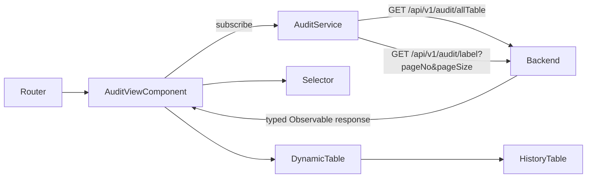
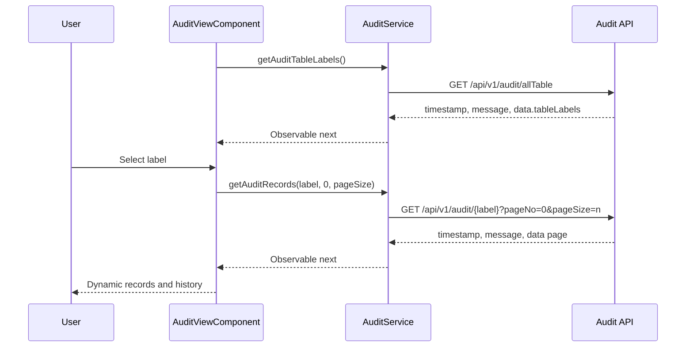

# Audit Feature Architecture

## Design

The audit feature is a lazy-loaded, standalone Angular feature at `/audit`.

## Ownership

### AuditService

- Owns both endpoint URLs.
- Trims and URL-encodes the selected label.
- Normalizes `pageNo` to a non-negative integer.
- Normalizes `pageSize` to a positive integer, defaulting to 10.
- Returns typed, cold HttpClient Observables.
- Propagates HTTP errors.

### AuditViewComponent

- Subscribes explicitly to label and record requests.
- Unsubscribes before replacing an in-flight request and on destroy.
- Owns loading, success, error, selection, filter, sort, expansion, and pagination state.
- Uses server pagination metadata as authoritative.
- Derives source columns from `originalData`.
- Derives history columns from each row's `auditHistory`.
- Exposes only source columns to the filter builder.

### Models

- `audit-table-label.model.ts`: table-label response.
- `audit-view.model.ts`: dynamic row, history, pagination, filter, and view models.

## Request sequence

On HTTP failure, the Observable errors and the component renders an error/retry state. No local
data source is queried.

## Pagination

The backend owns total counts and page boundaries. The component sends a zero-based page number
and selected size. A page-size change resets to page zero. First/previous/next/last controls are
enabled from response metadata.

## Dynamic schema

Main columns are the union of keys in non-null `originalData`. Only `ID` is omitted from the
generated list because the record identifier already renders in the dedicated ID column. Fields
such as `CREATED_BY`, `CREATED_ON`, `UPDATED_BY`, `UPDATED_ON`, and `VERSION` remain fully dynamic
and render whenever the selected API response supplies them.

History columns are computed per record from its history entries. The fixed history semantics
(`operation` and `revision`) render in dedicated columns, while transport/technical aliases such as
`REV`, `REVTYPE`, and `revisionTypeCode` are omitted from the generated history list. A feature
selection rebuilds both schemas, so new backend labels work without table-specific component code.

Column type inference stops after finding the first non-null value for a field. This avoids scanning
and allocating values for every record while preserving the same dynamic text, number, boolean, and
date behavior.

## Styling

Global `src/styles.css` contains only Tailwind import, base page colors, and scrollbar styling.
All audit presentation rules live in `audit-view.component.css` under Angular component encapsulation.
The Angular component schematic is configured with `type: component`, so future generated components
use the `.component.ts`, `.component.html`, `.component.css`, and `.component.spec.ts` convention.
