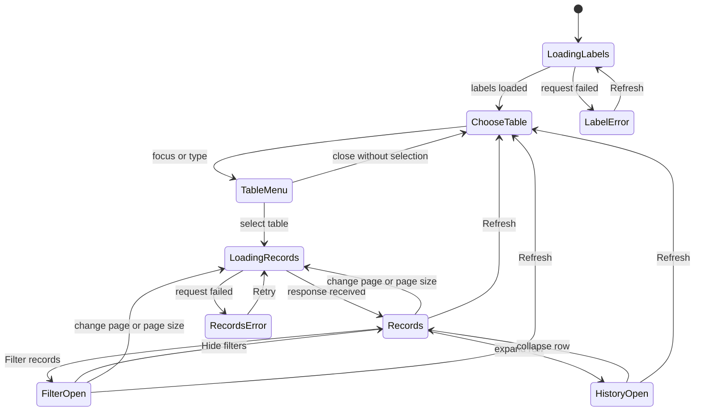
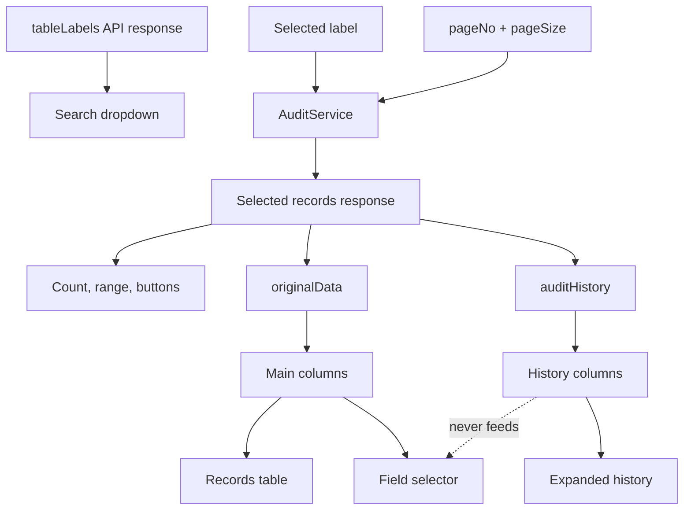

# UI and Interaction Specification

## Design intent

The Audit Viewer is a focused operational console, not a general dashboard. It uses a dark, high-contrast surface with gold emphasis, compact tables, and progressive disclosure:

- Start with feature selection.
- Reveal records after selection.
- Reveal filters only when requested.
- Reveal revision history only for expanded rows.

## Visual hierarchy

```text
AUDIT FEATURE
┌────────────────────────────────────────────────────────────┐ ┌───────────┐
│ Search by feature name...                    3 features  │ │ ↻ Refresh │
└────────────────────────────────────────────────────────────┘ └───────────┘

One of the following states:

A. Choose-feature state
B. Response banner + records table
C. Response banner + open filter builder + records table
D. Records table + expanded history
```

## State A: no selected feature

This is the initial state and the state after Refresh.

```text
┌──────────────────────────────────────────────────────────────────────────┐
│                                                                          │
│                                [ Search ]                                │
│                                                                          │
│                        Choose an audit feature                           │
│                                                                          │
│        Search by feature name above. Records load only after you         │
│                           select a feature.                              │
│                                                                          │
└──────────────────────────────────────────────────────────────────────────┘
```

Requirements:

- Dashed, muted gold boundary.
- Centered search icon, heading, and supporting text.
- No record count, filter, table, or pagination.
- Table labels may already be loaded; records must not be loaded.

## State B: feature selector open

```text
┌────────────────────────────────────────────────────────────┐
│ Search by feature name...                    3 features  │
├────────────────────────────────────────────────────────────┤
│ HC   Holiday Calendar                             Current ✓│
│      Holiday Calendar                                      │
│                                                            │
│ SG   Singapore locomotives                                 │
│      Loco Singapore                                        │
│                                                            │
│ PB   Position balances                                     │
│      Position Balance                                      │
└────────────────────────────────────────────────────────────┘
```

Requirements:

- Selector popover aligns exactly with the search field.
- Options display initials, friendly display name, and source label.
- Hover uses a slightly lighter dark surface.
- Selected option uses an olive surface, orange left accent, Current badge, and check mark.
- Search filters both source labels and friendly display names case-insensitively.
- Arrow Up/Down moves through results, Enter selects, and Escape closes the menu.
- Non-empty search text exposes a keyboard-accessible clear action.
- The count displays total available audit features.

## State C: open filter builder

```text
┌──────────────────────────────────────────────────────────────────────────┐
│ 2 TOTAL RECORDS                                         [ Hide filters ] │
├──────────────────────────────────────────────────────────────────────────┤
│ Filter records                              [+ Add condition] [Clear all]│
│ Choose AND or OR independently for each added rule.                      │
│                                                                          │
│ ┌──────────────────────────────────────────────────────────────────────┐ │
│ │ WHERE │ Field ▼ │ Condition: Contains ▼ │ Value                 │ × │ │
│ │AND│OR│ Field ▼ │ Condition: Equals ▼   │ Value                 │ × │ │
│ └──────────────────────────────────────────────────────────────────────┘ │
│ Number and date fields support comparisons. Filters use source fields.  │
├──────────────────────────────────────────────────────────────────────────┤
│ ID   ACCOUNT   METAL CODE   UOM   QUANTITY   LAST LEDGER   ...          │
└──────────────────────────────────────────────────────────────────────────┘
```

Requirements:

- Filter panel remains inside the records card.
- Hide filters uses the filled gold primary treatment.
- Add condition and Clear all align to the right on desktop.
- Each condition is one bounded row.
- The first join label is WHERE.
- Every later rule has its own compact AND/OR segmented control; changing it never changes another rule.
- AND groups are evaluated before OR groups.
- Field, operator, and value controls remain aligned.
- Condition and Value stay enabled before field selection; incomplete rules do not filter rows.
- Changing to a different Field clears Value and restores Condition to `Contains`; re-selecting
  the current Field preserves its Condition and Value.
- Field and Condition use matching dark controlled listboxes with a highlighted selected row, checkmark, and gold open-state focus treatment so their appearance is consistent across operating systems.
- Both lists support Arrow Up/Down, Home, End, type-ahead, Enter, Space, and Escape keyboard
  interaction.
- Value keeps the same compact control height and receives the shared gold focus treatment without opening an operating-system popup.
- The Field list contains only ID and displayed originalData fields.
- Empty/not-empty operators replace the value input with “No value required.”
- Controls use a compact two-row layout on tablets and stack on narrow screens.

## State D: dynamic records

Position Balance example:

```text
┌──────────────────────────────────────────────────────────────────────────┐
│ ID    ACCOUNT   UOM   LAST LEDGER   METAL CODE   QUANTITY  REV  STATE   │
├──────────────────────────────────────────────────────────────────────────┤
│ #1002 2956      FOZ   4006          LARGE BAR    0         2    Current │
│ #1003 2957      FOZ   4006          LARGE BAR    801       1    Current │
├──────────────────────────────────────────────────────────────────────────┤
│ 2 records across 1 page     Items per page: 10    1–2 of 2  |‹ ‹ › ›|   │
└──────────────────────────────────────────────────────────────────────────┘
```

Holiday Calendar example:

```text
ID    HOLIDAY DATE   CALENDAR   CALENDAR NAME              REV   STATE
#3001 2026-08-09     SG         Singapore Public Holidays  2     Current
```

Loco Singapore example:

```text
ID    LOCOMOTIVE  NAME            DEPOT  FLEET STATUS  LAST UPDATED  REV STATE
#2001 SG-L-001    Merlion One     TJS    AVAILABLE     2026-08-28    3   Current
#2002 SG-L-002    Harbour Runner  PSA    IN_SERVICE    2026-09-09    2   Current
#1998 —           —               —      —             —             2   Audit only
```

Requirements:

- Table schema changes after every table selection.
- ID, Revisions, and Record State remain dedicated columns.
- ID, source columns, Revisions, and Record State cycle through ascending, descending, and unsorted states.
- Every `originalData` source column is displayed dynamically except `ID`, which already has a dedicated column.
- Missing current data displays an em dash.
- Wide schemas scroll horizontally instead of shrinking text below readability.
- Revision count uses a compact gold indicator.
- State uses both text and a colored dot.
- Only records with more than one revision show an expansion control.
- Page-size choices are 10, 25, 50, and 100.

## Expanded revision history

```text
▼ #1998  —  —  —  —  2  Audit only
│
└─ Audit history — 2 revisions for record #1998
   ┌──────────────────────────────────────────────────────────────────────┐
   │ OPERATION REVISION LOCOMOTIVE CODE NAME ... MODEL MANUFACTURER ... │
   ├──────────────────────────────────────────────────────────────────────┤
   │ INSERT    #9008   SG-L-LEGACY     Jurong Pioneer ...               │
   │ DELETE    #9251   SG-L-LEGACY     Jurong Pioneer ...               │
   └──────────────────────────────────────────────────────────────────────┘
```

Requirements:

- History is visually connected to its source row with a left accent.
- A rounded tree branch links the expanded record column to the Audit history heading.
- Only one history row is expanded at a time; clicking an expandable row or its arrow toggles it.
- History has its own independently generated schema.
- INSERT is green, UPDATE is blue, DELETE is red.
- Null is rendered explicitly as italic “null.”
- Operation, Revision, and every dynamic history column cycle through ascending, descending, and
  unsorted states without changing the API response order.
- History is width-contained inside its parent record and bounded vertically. Its sticky header and
  slim scrollbar keep both axes reachable near the expanded record; the scrollbar is revealed on
  hover or keyboard focus only when the dynamic schema overflows.
- The main records region is also bounded with a sticky header. Pointer/focus interaction inside
  history activates the history scroller without activating the outer records scroller.
- The history scroll region is keyboard-focusable and receives a visible focus treatment.
- A horizontal trackpad gesture, mouse tilt wheel, `Shift + mouse wheel`, or dragging the revealed
  scrollbar moves only the table under the pointer, including at either horizontal boundary.
- Each dynamic history value is compared with the prior chronological revision. Changed values use
  an orange marker/background and expose `Changed from … to …` on hover; the first revision is the
  unhighlighted baseline and visual sorting never changes the comparison relationship.

## Interaction state model



## Data-to-UI ownership



## Color and component guidance

| Role                            | Treatment                          |
| ------------------------------- | ---------------------------------- |
| Page                            | Near-black background              |
| Main surface                    | Warm charcoal                      |
| Elevated/selected surface       | Slightly lighter charcoal or olive |
| Primary action                  | Gold fill with dark text           |
| Section label and table headers | Gold text                          |
| Condition join keyword          | Orange                             |
| Current/INSERT                  | Green text and dark-green surface  |
| UPDATE/status                   | Blue text and dark-blue surface    |
| Audit only/DELETE/error         | Red text and dark-red surface      |
| Secondary text                  | Warm gray                          |
| Dividers                        | Low-contrast warm gray/brown       |

## Spacing and sizing

- Desktop page uses a centered, wide content region.
- Search and Refresh share one row; search takes remaining width.
- Primary controls target approximately 44–64 pixels in height.
- Records card header and footer remain visually balanced.
- Table rows use compact but readable vertical padding.
- Filter conditions use a consistent grid so fields line up across rows.
- Rounded corners are used for major surfaces and controls, not every cell.

## Responsive behavior

### Above 1100 pixels

- Search and Refresh appear side by side.
- Filter introduction and actions appear on one row.
- Each condition appears as WHERE + Field + Condition + Value + Remove.
- Short response schemas fill the available card width; wide schemas scroll horizontally.

### 761–1100 pixels

- Search and Refresh remain side by side while space allows.
- Each condition uses a compact join line above aligned Field, Condition, and Value controls.
- Dynamic records and history keep readable cells with horizontal scrolling.

### 561–760 pixels

- Search and Refresh stack.
- Toolbar and footer stack or wrap without overlap.
- Filter header/actions wrap.
- Filter controls become a single column; Remove stays aligned with the rule join.
- Pagination wraps without overlapping.

### Below 560 pixels

- Hide the table-count badge if space is insufficient.
- Filter button becomes full-width within the toolbar.
- Expanded-history left padding reduces.
- Native controls remain large enough for touch.

The implementation details and viewport verification matrix are documented in
[AUDIT-UI-REFINEMENT.md](AUDIT-UI-REFINEMENT.md).

## Content strings

| Context              | Copy                                                                                                           |
| -------------------- | -------------------------------------------------------------------------------------------------------------- |
| Empty heading        | Choose an audit feature                                                                                        |
| Empty support        | Search by feature name above. Records load only after you select a feature.                                    |
| Loading features     | Loading audit features                                                                                         |
| No API features      | No audit features available                                                                                    |
| No search matches    | No features match “{query}”.                                                                                   |
| Search placeholder   | Search by feature name...                                                                                      |
| Closed filter action | Filter records                                                                                                 |
| Open filter action   | Hide filters                                                                                                   |
| Filter heading       | Filter records                                                                                                 |
| Filter support       | Build precise rules from the selected table.                                                                   |
| Filter help          | Number and date fields support comparisons. Filters use source-table fields and apply to the current API page. |
| Loading records      | Loading audit records…                                                                                         |
| No filter matches    | No matching records                                                                                            |
| Retry action         | Retry                                                                                                          |

## UI acceptance checklist

- [x] Empty state is the first records-area state.
- [x] Dropdown visually indicates current selection.
- [x] Table and history columns are independent and dynamic.
- [x] Filter builder matches the supplied layout hierarchy.
- [x] Source-only field restriction is visible and tested.
- [x] Every record and audit-history data header is sortable and exposes its direction.
- [x] Pagination is aligned to the lower right on desktop.
- [x] Refresh clears the selection.
- [x] Narrow layouts stack without overlap.
- [x] Interactive controls use native semantic elements.
